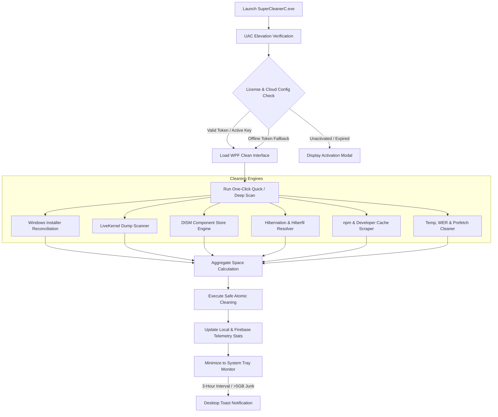

# Super Cleaner C

<div align="center">

```
   _____                      ________                              ______ 
  / ___/__  ______  ___  _____/ ____/ /__  ____ _____  ___  _____   / ____/ 
  \__ \/ / / / __ \/ _ \/ ___/ /   / / _ \/ __ `/ __ \/ _ \/ ___/  / /      
 ___/ / /_/ / /_/ /  __/ /  / /___/ /  __/ /_/ / / / /  __/ /     / /___    
/____/\__,_/ .___/\___/_/   \____/_/\___/\__,_/_/ /_/\___/_/      \____/    
          /_/                                                               
```

**Next-Generation High-Performance Windows System Optimizer & Deep Cleaner**

[-0078D6?style=for-the-badge&logo=windows&logoColor=white)](https://github.com/weka-eg/SuperCleanerC-Releases)
[-512BD4?style=for-the-badge&logo=dotnet&logoColor=white)](https://dotnet.microsoft.com/)
[-2ea44f?style=for-the-badge&logo=semver&logoColor=white)](https://github.com/weka-eg/SuperCleanerC-Releases/releases)
[](https://github.com/weka-eg/SuperCleanerC-Releases)
[-blue?style=for-the-badge&logo=security&logoColor=white)](https://github.com/weka-eg/SuperCleanerC-Releases)
[](https://t.me/Vandiom5)

[Features](#-key-features) • [Installation](#-installation) • [System Requirements](#-system-requirements) • [How It Works](#-how-it-works) • [Screenshots](#-interface--screenshots) • [Integrity Verification](#-integrity--sha-256-verification) • [Security & Privacy](#-security--privacy) • [Support](#-contact--support)

---

</div>

## 📖 Overview

**Super Cleaner C** is an enterprise-grade, standalone Windows optimization and deep cleaning utility engineered in C# and WPF on .NET 8. It targets system junk, orphaned installer caches, component store bloat, kernel crash dumps, developer caches, and dormant hibernation files that conventional cleaning utilities consistently overlook.

Designed as a **portable, single-file executable**, Super Cleaner C requires no installation, leaves no unmanaged registry leftovers, and comes fully bundled with its .NET 8 runtime for instant execution on any modern 64-bit Windows environment.

---

## ✨ Key Features

| Feature | Description | Impact |
| :--- | :--- | :--- |
| 🧩 **Patch Cleaner** | Deep-scans `C:\Windows\Installer` against the Windows Registry to isolate and eliminate orphaned `.msi` and `.msp` packages. | Reclaims 5 GB – 30 GB |
| ⚡ **LiveKernel Reports** | Purges dormant kernel-level crash diagnostics and hardware triage minidumps from `%SystemRoot%\LiveKernelReports`. | Reclaims 1 GB – 10 GB |
| 🔋 **Hibernation Optimizer** | One-click toggling of Windows Hibernation via `powercfg -h off` with immediate zero-byte reclamation of `hiberfil.sys`. | Reclaims 8 GB – 64 GB (RAM size) |
| 📦 **npm Cache Cleaner** | Scans and cleans persistent Node.js/npm global package caches located in `%AppData%\npm-cache` and `~/.npm`. | Reclaims 2 GB – 15 GB |
| 🛠️ **Windows Component Store** | Integrates with native Windows DISM engine (`/StartComponentCleanup /ResetBase`) to consolidate and compress superseded WinSxS components. | Reclaims 3 GB – 12 GB |
| 🧹 **Deep Temp & Prefetch** | Comprehensive cleaner for User/System `%TEMP%`, `Prefetch`, CrashDumps, Windows Error Reporting (WER), and SoftwareDistribution downloads. | Reclaims 2 GB – 20 GB |
| 🛡️ **System Tray Monitor** | Silent, low-overhead background monitor running periodic 3-hour junk assessments with smart notifications when junk exceeds 5 GB. | Zero CPU impact |
| ☁️ **Cloud-Managed Config** | Real-time synchronization with Google Firebase to dynamically push cleaning rules, maintenance flags, and urgent security broadcasts. | Instant policy delivery |
| 🔑 **Hardware-Locked Licensing** | Cryptographically bound 1-PC hardware license system utilizing SHA-256 hashed hardware GUIDs and AES-256 protected local registries. | Uncompromising protection |
| 🔄 **Dual-Engine Auto-Updater** | Integrated background update manager supporting both prompted visual updates and silent background binary replacements. | Zero-friction upgrades |

---

## 🚀 Installation

Super Cleaner C is 100% portable. No installer, wizard, or third-party dependencies are required.

1. **Download** the latest release bundle (`SuperCleanerC.exe` or `SuperCleanerC_v1.2.zip`) from the official repository:
   - [Official Releases Repository](https://github.com/weka-eg/SuperCleanerC-Releases)
   - Or contact our team directly via [Telegram Support](https://t.me/Vandiom5)
2. **Move** `SuperCleanerC.exe` to your preferred folder (e.g., `C:\Tools\SuperCleanerC\` or USB flash drive).
3. **Right-click** and select **Run as Administrator** (Administrative elevation is required to manage DISM, Windows Installer caches, and system-level directories).
4. Enter your unique **Activation Key** when prompted to bind the software to your hardware.

> [!IMPORTANT]
> Super Cleaner C modifies system-protected caches (`C:\Windows\Installer`, `WinSxS`, `LiveKernelReports`). **Administrator privileges** are mandatory. The application will automatically request UAC elevation upon launch.

---

## 💻 System Requirements

| Requirement | Minimum Specification | Recommended Specification |
| :--- | :--- | :--- |
| **Operating System** | Windows 10 (64-bit, Version 1809+) | Windows 11 (64-bit, All Builds) |
| **Architecture** | x64 (AMD64 / Intel 64) | x64 |
| **Runtime** | **None** (Bundled .NET 8 Self-Contained) | **None** (Bundled .NET 8 Self-Contained) |
| **Privileges** | Local Administrator Rights | Local Administrator Rights |
| **Memory (RAM)** | 512 MB available | 2 GB+ |
| **Disk Space** | 180 MB free for executable | 500 MB free storage |
| **Network** | Internet connection for initial activation | Broadband connection for real-time cloud updates |

---

## ⚙️ How It Works

Super Cleaner C utilizes a multi-layered pipeline to ensure rapid scanning, maximum disk space recovery, and absolute operating system safety.



### 1. Scanning Phase
When you click **Scan**, the application asynchronously inspects your storage drives across all active cleaner modules. Registry hives (`HKLM\Software\Microsoft\Windows\CurrentVersion\Installer\UserData`) are cross-referenced against `C:\Windows\Installer` to identify orphaned files without touching active software setups.

### 2. Cleaning Phase
Clean operations execute atomically with real-time progress callbacks. System services and temporary file handles are safely released, locked files are scheduled for boot-time cleanup if needed, and DISM base resets compress Windows component backups without breaking core dependencies.

### 3. Background Tray Monitoring
When minimized, Super Cleaner C parks in the Windows Notification Area consuming minimal memory (~15 MB). Every 3 hours, a non-intrusive background check evaluates accumulation across temp zones. If accumulated junk exceeds **5 GB**, a native toast alert invites you to perform a one-click clean.

---

## 🖼️ Interface & Screenshots

<div align="center">

```
+-------------------------------------------------------------------------+
|  [⚡] SUPER CLEANER C v1.2                           [—] [口] [X]        |
+-------------------------------------------------------------------------+
|  STATUS: System Protected & Activated                     [ WEKA TEAM ] |
|                                                                         |
|  [  SCAN NOW  ]             [  CLEAN SYSTEM NOW  ]                      |
|                                                                         |
|  Found Junk: 24.85 GB                                                   |
|  ---------------------------------------------------------------------  |
|  [X] Windows Installer Orphaned Patches (.msi/.msp)           14.20 GB  |
|  [X] DISM Windows Component Store (WinSxS)                     4.60 GB  |
|  [X] Hibernation File Optimizer (hiberfil.sys)                 3.80 GB  |
|  [X] LiveKernel Diagnostic Dump Reports                        1.15 GB  |
|  [X] Node.js npm Cache Files                                   0.85 GB  |
|  [X] System & User Temp / Prefetch Caches                      0.25 GB  |
|                                                                         |
|  System Tray Monitor: ACTIVE (Interval: 3h | Threshold: 5 GB)           |
+-------------------------------------------------------------------------+
```

*(Place visual interface screenshots in `/Assets/Screenshots/` before building public docs)*

</div>

---

## 🔐 Integrity & SHA-256 Verification

Every official release binary is code-signed by **WEKA TEAM** and published with a cryptographic SHA-256 checksum. Always verify your download before running.

### 1. Verify SHA-256 Checksum via PowerShell
```powershell
Get-FileHash -Path ".\SuperCleanerC.exe" -Algorithm SHA256 | Format-List
```
Compare the output hash with the official hash published in the [GitHub Release Notes](https://github.com/weka-eg/SuperCleanerC-Releases).

### 2. Verify Authenticode Digital Signature
```powershell
Get-AuthenticodeSignature -FilePath ".\SuperCleanerC.exe" | Format-List
```
Expected Status: `Valid`  
Signer Subject: `CN=WEKA TEAM, O=WEKA TEAM, C=EG`  
Hash Algorithm: `SHA256`

---

## 🛡️ Security & Privacy

We believe in complete transparency and user privacy. Super Cleaner C is engineered with **Privacy by Design**:
- **Zero Personal Data Collection**: We never access your documents, photos, browsing history, keystrokes, or credentials.
- **Irreversible Anonymization**: Hardware identifiers are hashed via SHA-256 on the client side before transmission.
- **Encrypted Communications**: All cloud communications with Firebase utilize HTTPS / TLS 1.2+ with strict endpoint routing.

For comprehensive details, please review our dedicated documentation:
- 🔒 **[Privacy Policy](PRIVACY.md)** — Complete breakdown of collected telemetry and data retention policies.
- 🛡️ **[Security Policy](SECURITY.md)** — Cryptographic details, obfuscation methods, and vulnerability reporting.

---

## 📄 License

**Super Cleaner C** is proprietary software developed and owned by **WEKA TEAM**.

- **Copyright © 2026 WEKA TEAM. All rights reserved.**
- Single-seat licenses are restricted to **1 physical PC per activation key**.
- Unauthorized redistribution, decompilation, modification, or cracking is strictly prohibited.

---

## 💬 Contact & Support

Need assistance, bulk licenses, or want to report an issue? Reach out directly:

- **Lead Developer**: WEKA TEAM
- **Official Telegram Support**: [@Vandiom5](https://t.me/Vandiom5)
- **Direct Telegram Channel**: [https://t.me/Vandiom5](https://t.me/Vandiom5)
- **GitHub Repository**: [weka-eg/SuperCleanerC-Releases](https://github.com/weka-eg/SuperCleanerC-Releases)

---

<div align="center">
  <sub>Built with ❤️ by WEKA TEAM. Empowering Windows users with cleaner, faster, and healthier PCs.</sub>
</div>
