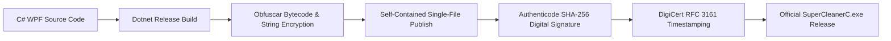

# Security Policy for Super Cleaner C

**Developer:** WEKA TEAM  
**Effective Date:** September 17, 2026  
**Primary Contact:** [@Vandiom5](https://t.me/Vandiom5)

---

##  Security Overview & Philosophy

**Super Cleaner C** performs low-level operating system maintenance, driver shader optimization, browser engine cache clearing, and system integrity maintenance. Security, binary integrity, and data protection are central to every release built by **WEKA TEAM**.

This Security Policy outlines the cryptographic controls, system safeguards, update validation mechanisms, and vulnerability reporting procedures implemented in Super Cleaner C.

---

##  Supported Versions

We provide active security maintenance, vulnerability patches, and cloud configuration support according to the following version matrix:

| Version | Status | Release Date | Support Level |
| :--- | :---: | :---: | :--- |
| **v1.3** | 🟢 **Supported** | September 2026 | Active production release; receives full cloud updates and hotfixes. |
| **v1.2** | 🟢 **Supported** | August 2026 | Production release; upgrade to v1.3 recommended. |
| **v1.1** | 🟡 **Deprecated** | July 2026 | Limited support; upgrade to v1.3 recommended. |
| **v1.0** | 🔴 **End of Life** | June 2026 | Deprecated; blocked from remote configuration and activation. |
| **< v1.0** | 🔴 **Unsupported** | Beta / Pre-release | Revoked and disabled. |

---

##  Binary Integrity & Authenticity

To protect users against supply-chain tampering, unauthorized repackaging, and man-in-the-middle attacks, every official release of Super Cleaner C undergoes a strict cryptographic verification workflow:



### 1. Cryptographic Hash (SHA-256)
Every release on GitHub is published alongside an authoritative SHA-256 hash. Users can verify binary integrity using PowerShell:
```powershell
Get-FileHash -Path ".\SuperCleanerC.exe" -Algorithm SHA256
```

### 2. Authenticode Code Signing
The executable is digitally signed using an enterprise Authenticode certificate issued to **WEKA TEAM** with SHA-256 hashing and an RFC 3161 compliant timestamp from DigiCert.
```powershell
Get-AuthenticodeSignature -FilePath ".\SuperCleanerC.exe" | Format-List
```
Verify that:
- `Status` equals **Valid**
- `SignerCertificate.Subject` contains **CN=WEKA TEAM**
- `TimeStamperCertificate` is valid and verified.

---

##  Network & Cloud Communication Security

- **Strict Transport Security:** All outgoing network traffic to cloud backends utilizes **HTTPS / TLS 1.2+** exclusively. Unencrypted HTTP traffic is rejected at the socket level.
- **Cloud Infrastructure Security:** Cloud communications interface directly with enterprise Google Firebase Realtime Database backends protected by rigorous server-side security rules.
- **Short Timeout Boundaries:** All outbound HTTP requests enforce strict timeouts to prevent hanging threads or potential connection leaks.
- **Offline Resilience:** If network connectivity drops or remote servers are unreachable, activated clients smoothly transition to local cryptographic validation tokens without exposing the user to downtime.

---

##  Local Data Protection & Cryptographic Licensing

- **Hardware Fingerprint Hashing:** The system's unique identifier is never stored or transmitted in raw form. It is generated by calculating an irreversible, one-way SHA-256 cryptographic hash over system hardware characteristics.
- **Local Storage Hardening:** License activation tokens are protected locally using strong cryptography and Windows DPAPI (Data Protection API) hardware locking:
  $$\text{Token} = \text{HMAC-SHA256}(\text{Key}, \text{HWID} \parallel \text{SecretSalt})$$
- **Anti-Clock Tampering:** The licensing engine validates sequential timestamps to prevent unauthorized trial extension via system date rollbacks.
- **Machine Revocation:** Compromised or pirated keys are revoked dynamically via cloud sync and persisted locally in an immutable state.

---

##  Secure Auto-Update Engine

Super Cleaner C includes a hardened auto-update engine that safeguards against malicious payload delivery:

1. **Remote Version Auditing:** The application retrieves update manifests directly over HTTPS from authenticated cloud endpoints.
2. **Payload Verification:** Downloaded update binaries are verified against the published remote SHA-256 checksum prior to execution.
3. **Isolated Staging:** Temporary update files are downloaded into a secure staging directory, verified for code signatures, and then swapped atomically.
4. **Mandatory & Silent Updates:** Security hotfixes can be deployed silently or flagged as mandatory when critical vulnerabilities are patched.

---

##  Code Protection & Anti-Reverse Engineering

To protect intellectual property, cryptographic salts, and anti-piracy mechanisms from decompilation (e.g. dnSpy, ILSpy, de4dot):

- **String & Resource Encryption:** Sensitive strings (including internal paths, cryptographic parameters, and API endpoints) are encrypted at the bytecode level.
- **Private Member Obfuscation:** Internal fields, private methods, and cryptographic helpers are obfuscated using **Obfuscar** while maintaining stable WPF data-binding interfaces.
- **Control Flow Protection:** Critical routines (such as activation validation and hash comparison) utilize scrambled control flow blocks.
- **Single-File Bundling:** The application is packed as a self-contained single executable with native runtime bundling.

---

## ⚙️ Cleaning Engine Safety & System Protection

Super Cleaner C is engineered under strict non-destructive safety principles to preserve operating system stability:

- **Package Registration Validation:** Identifies and targets only orphaned deployment packages with verified zero active system associations, safeguarding critical application dependencies.
- **Native Subsystem Integration:** Operating system maintenance routines interface directly through official Microsoft system APIs and subsystems, preventing component or registry corruption.
- **Non-Invasive Process Handling:** In-use and active system buffers are gracefully bypassed rather than forcefully terminated, avoiding application instability or process crashes.
- **Privilege Separation & Smart Elevation:** The primary interface executes with standard user privileges for safe background monitoring, requesting administrative elevation on-demand only for authorized low-level maintenance tasks.
- **System Restore Integration:** Users can automatically generate a Windows System Restore Point prior to maintenance cycles to establish a secure recovery baseline.
- **Data & Identity Quarantine:** Cleaning operations are strictly restricted to transient cache buffers, ensuring personal credentials, user sessions, and application states remain completely untouched.

---

##  Reporting a Vulnerability

We take reports of security vulnerabilities seriously and appreciate the efforts of security researchers. If you discover a vulnerability or security flaw, please adhere to our **Responsible Disclosure** guidelines:

### How to Report:
1. **Direct Telegram Contact:** Contact the lead developer via Telegram at [@Vandiom5](https://t.me/Vandiom5) ([https://t.me/Vandiom5](https://t.me/Vandiom5)).
2. **Include Key Details:**
   - Detailed description of the vulnerability.
   - Steps to reproduce the issue (proof-of-concept script, sample input, or screenshot).
   - Affected version(s).
   - Any proposed remediation or mitigation.
3. **Confidentiality:** Please do not disclose or publish details of the vulnerability publicly until a patch has been released and verified.

### Response SLA:
- **Initial Response & Acknowledgment:** Within **24 to 48 hours**.
- **Triage & Assessment:** Within **3 business days**.
- **Hotfix Release:** Critical vulnerabilities will be addressed in an emergency patch release within **7 days**.

---

<div align="center">
  <sub>Super Cleaner C Security Policy • Maintained by WEKA TEAM</sub>
</div>
