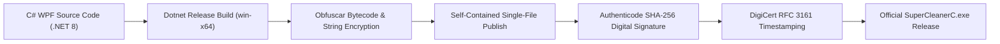

# Security Policy for Super Cleaner C

**Developer:** WEKA TEAM  
**Effective Date:** September 17, 2026  
**Primary Contact:** [@Vandiom5](https://t.me/Vandiom5)

---

## Security Overview & Philosophy

**Super Cleaner C** performs operating system optimization, graphics driver shader purging, browser engine cache clearing, Windows Installer database reconciliation, DISM Component Store consolidation, and deep system maintenance. Security, binary integrity, privacy, and operating system stability are central to every release built by **WEKA TEAM**.

This Security Policy outlines the cryptographic controls, system safeguards, update validation mechanisms, and vulnerability reporting procedures implemented in Super Cleaner C.

---

## Supported Versions

We provide active security maintenance, vulnerability patches, and cloud configuration support according to the following version matrix:

| Version | Status | Release Date | Support Level |
| :--- | :---: | :---: | :--- |
| **v1.3** | **Supported (Current)** | September 2026 | Active production release; receives full cloud updates, feature enhancements, and hotfixes. |
| **v1.2** | **Supported** | August 2026 | Production release; receives security updates. Upgrade to v1.3 recommended. |
| **v1.1** | **Deprecated** | July 2026 | Limited support; upgrade to v1.3 recommended. |
| **v1.0** | **End of Life** | June 2026 | Deprecated; blocked from remote configuration and activation. |
| **< v1.0** | **Unsupported** | Beta / Pre-release | Revoked and disabled. |

---

## Binary Integrity & Authenticity

To protect users against supply-chain tampering, unauthorized repackaging, and man-in-the-middle attacks, every official release of Super Cleaner C undergoes a strict cryptographic verification workflow:



### 1. Cryptographic Hash (SHA-256)
Every release on GitHub is published alongside an authoritative SHA-256 hash. Users can verify binary integrity using PowerShell:
```powershell
Get-FileHash -Path ".\SuperCleanerC.exe" -Algorithm SHA256
```

### 2. Authenticode Code Signing
The executable is digitally signed using an enterprise Authenticode certificate issued to **WEKA TEAM** with SHA-256 hashing and an RFC 3161 compliant timestamp from DigiCert.
```powershell
Get-AuthenticodeSignature -FilePath ".\SuperCleanerC.exe" | Format-List
```
Verify that:
- `Status` equals **Valid**
- `SignerCertificate.Subject` contains **CN=WEKA TEAM**
- `TimeStamperCertificate` is valid and verified.

---

## Operating System Safety & Restore Points

Starting with **v1.3**, Super Cleaner C includes built-in protective layers to prevent system instability:

- **Automated System Restore Point:** The user can enable automatic Windows System Restore Point creation prior to cleaning. In the unlikely event of any issue, Windows can be restored to its exact pre-cleaning state.
- **Smart UAC Elevation Isolation:** The main UI runs with standard user rights (`asInvoker`). When system-level directories (`C:\Windows`, `C:\Windows.old`, `SoftwareDistribution`) require cleanup, operations are dispatched to an isolated, elevated background worker on demand.
- **Strict Data Isolation:**
  - **Browser Cleaning:** Strictly targets temporary cache, compiled V8 bytecode, and graphical shaders. User profiles, cookies, saved credentials, and history are explicitly quarantined and preserved.
  - **Game & GPU Cleaning:** Strictly targets compiled shader cache files and launcher web caches. Game save files (`Saved Games`, `Documents\My Games`) and graphics settings are never touched.

---

## Network & Cloud Communication Security

- **Strict Transport Security:** All outgoing network traffic to cloud backends utilizes **HTTPS / TLS 1.2+** exclusively. Unencrypted HTTP traffic is rejected at the socket level.
- **Firebase Endpoint Security:** Cloud communications communicate directly with official Google Firebase REST endpoints with strict read/write security rules.
- **Short Timeout Boundaries:** All outbound HTTP requests enforce strict timeouts to prevent hanging threads or potential connection leaks.
- **Offline Resilience:** If network connectivity drops or remote servers are unreachable, activated clients smoothly transition to local cryptographic validation tokens without exposing the user to downtime.

---

## Local Data Protection & Cryptographic Licensing

- **Hardware Fingerprint Hashing:** The system's unique identifier is never stored or transmitted in raw form. It is generated by calculating a one-way SHA-256 cryptographic hash over `MachineGuid`, ensuring complete irreversibility.
- **Registry Hardening:** License activation tokens are stored in `HKCU\Software\SuperCleanerC\License`. Tokens are encrypted using AES-256 and protected via Windows DPAPI (Data Protection API) tied to the specific physical machine.
- **Anti-Clock Tampering:** The licensing engine validates sequential timestamps and cloud UTC synchronizations to prevent unauthorized trial extension via system date rollbacks.
- **Instant Revocation (Step 0 Lock):** Revoked or refunded keys are disabled immediately via real-time cloud sync and persisted locally in an immutable lock state.

---

## Secure Auto-Update Engine

Super Cleaner C includes a hardened auto-update engine that safeguards against malicious payload delivery:

1. **Remote Version Auditing:** The application retrieves update manifests directly over HTTPS from authenticated cloud endpoints.
2. **Payload Verification:** Downloaded update binaries are verified against the published remote SHA-256 checksum prior to execution. If a single byte differs, the update is aborted and deleted immediately.
3. **Isolated Staging:** Temporary update files are downloaded into a secure staging directory, verified for code signatures, and then swapped atomically.
4. **Mandatory & Silent Updates:** Security hotfixes can be deployed silently or flagged as mandatory when critical updates are released.

---

## Code Protection & Anti-Reverse Engineering

To protect intellectual property, cryptographic salts, and anti-tamper mechanisms:

- **String & Resource Encryption:** Sensitive strings (including registry paths, cryptographic salts, and API endpoints) are encrypted at the bytecode level.
- **Private Member Obfuscation:** Internal fields, private methods, and cryptographic helpers are obfuscated using **Obfuscar** while maintaining stable WPF data-binding interfaces.
- **Control Flow Protection:** Critical routines (such as activation validation and hash comparison) utilize scrambled control flow blocks.
- **Single-File Bundling:** The application is packed as a self-contained single executable with native runtime bundling.

---

## Reporting Security Vulnerabilities

We welcome security researchers and community members to report potential vulnerabilities responsibly:

1. Contact the lead developer on Telegram: [@Vandiom5](https://t.me/Vandiom5)
2. Provide a detailed description of the issue, affected version, and reproduction steps.
3. We will acknowledge receipt within 24 hours and provide a remediation timeline.
